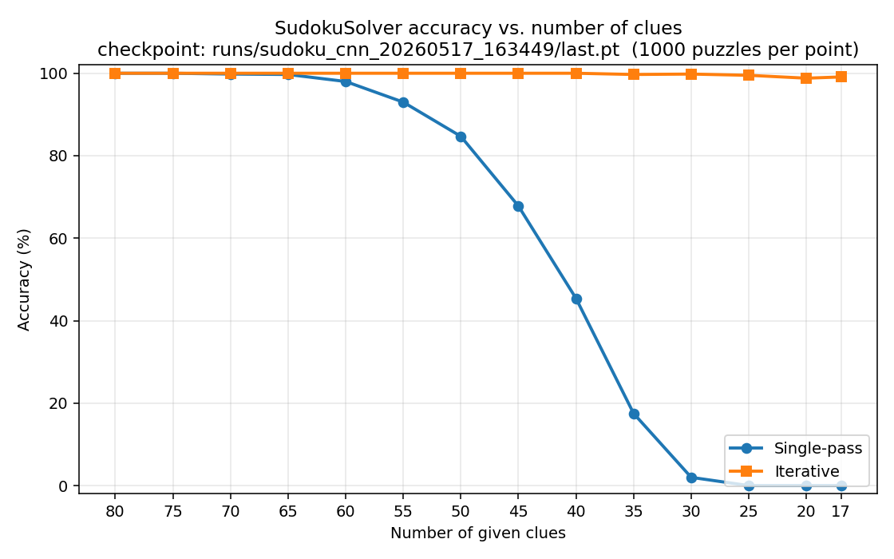

# SudokuNet

A learned 9×9 Sudoku solver. The model is a hybrid CNN + constraint-aware
Transformer trained from scratch on puzzles generated on the fly. At inference
time it can either fill all blanks in a single forward pass or solve
iteratively (fix the single most-confident blank, re-run, repeat).

## Pretrained weights

The trained checkpoint used for the results below is hosted on Google Drive:

- **[`sudoku_cnn_20260517_163449/last.pt`](https://drive.google.com/drive/folders/1GyYQ5D4laih6tBdw8Vga08TUG_6apMvK)** — download and
  drop into `runs/sudoku_cnn_20260517_163449/last.pt`.

## Results

Sweep over clue counts on 1000 fresh puzzles per point with checkpoint
[`runs/sudoku_cnn_20260517_163449/last.pt`](runs/sudoku_cnn_20260517_163449/last.pt):



| clues | single-pass | iterative | single-pass time | iterative time |
| ----: | ----------: | --------: | ---------------: | -------------: |
|    80 |     100.0 % |   100.0 % |          0.14 ms |        0.10 ms |
|    75 |     100.0 % |   100.0 % |          0.10 ms |        0.62 ms |
|    70 |      99.8 % |   100.0 % |          0.10 ms |        1.15 ms |
|    65 |      99.7 % |   100.0 % |          0.10 ms |        1.68 ms |
|    60 |      98.0 % |   100.0 % |          0.10 ms |        2.21 ms |
|    55 |      93.0 % |   100.0 % |          0.10 ms |        2.75 ms |
|    50 |      84.7 % |   100.0 % |          0.10 ms |        3.28 ms |
|    45 |      67.8 % |   100.0 % |          0.10 ms |        3.82 ms |
|    40 |      45.4 % |   100.0 % |          0.10 ms |        4.35 ms |
|    35 |      17.5 % |    99.7 % |          0.10 ms |        4.88 ms |
|    30 |       2.0 % |    99.8 % |          0.10 ms |        5.42 ms |
|    25 |       0.0 % |    99.5 % |          0.11 ms |        5.95 ms |
|    20 |       0.0 % |    98.8 % |          0.11 ms |        6.49 ms |
|    17 |       0.0 % |    99.1 % |          0.10 ms |        6.82 ms |

Accuracy = fraction of boards whose every row, column, and 3×3 box is a
permutation of 1–9. Wall-clock is per puzzle, batch=250, RTX 5070 Ti, AMP off.

Reproduce:

```bash
python evaluate_accuracy.py --checkpoint runs/sudoku_cnn_20260517_163449/last.pt
```

## Architecture ([model.py](model.py))

Pipeline: `(B, 9, 9)` long tokens → embedding + structured positional encoding
→ CNN front-end → stack of Sudoku Transformer blocks → per-cell digit logits
`(B, 9, 9, 9)` (class dim at index 1, drop-in for `nn.CrossEntropyLoss`).

- **Structured positional encoding.** Three learnable embeddings (row, column,
  3×3 box) are concatenated and projected. Every cell knows the three
  constraint-relevant coordinates from the first layer.
- **CNN front-end.** `Conv2d → BN → GELU` followed by `num_res_blocks` 3×3
  residual blocks; gives each cell a rich local feature before the trunk.
- **Sudoku Transformer block.** Each block runs (1) global self-attention over
  all 81 cells, (2) row-axis attention, (3) column-axis attention, (4) box-axis
  attention, (5) a position-wise FFN. The axis-restricted passes use boolean
  attention masks computed once and registered as buffers — explicit inductive
  bias for the three Sudoku constraints. Pre-norm everywhere for stable
  gradients.
- **Output head.** `LayerNorm → Linear → GELU → Linear` projecting each cell
  to 9 digit logits.

Current instantiation (`embed_dim=64, channels=256, num_res_blocks=2,
num_transformer_blocks=4, num_heads=4`) is **8.9 M parameters**.

## Data ([dataset.py](dataset.py))

Puzzles are generated on the fly in `__getitem__`:

1. `Sudoku.generate_solved_board()` randomly fills the three diagonal 3×3
   boxes, then completes the board with a Numba-JIT MRV (minimum-remaining-
   values) backtracking solver. Bitmask-based row/col/box tracking and
   Fisher-Yates shuffling of candidates keep generation fast.
2. A random subset of cells is replaced with the mask token (`9`).

Encoding is consistent everywhere: digits `1–9` are stored as `0–8`, and `9`
means *unknown*. The `+1` / `−1` conversion only happens at display time in
`inference.py`. The first epoch pays a ~30 s Numba JIT compile cost, then
generation is essentially free.

The `max_mask` curriculum bound is shared between the main process and
DataLoader workers via `multiprocessing.Value`, so curriculum updates
propagate even when `persistent_workers=True` and workers have already forked.

## Training ([trainer.py](trainer.py), [train.py](train.py))

- **AMP** (mixed precision) via `torch.amp.autocast` + `GradScaler`.
- **Curriculum learning.** Start with `curriculum_start_mask` masked cells and
  linearly ramp to `max_mask` over `curriculum_ramp_frac × num_epochs` epochs.
  Lets the model see easy puzzles first while gradually exposing harder ones.
- **AdamW + cosine LR with linear warmup.** `warmup_epochs` epochs of linear
  warmup, then cosine decay to `lr_min`.
- **NaN / Inf guards.** Non-finite loss → skip batch. Non-finite grad norm
  after `clip_grad_norm_` → skip the optimizer step (but still advance the
  scaler and scheduler so AMP recovers).
- **DDP.** `train.py --gpus 0,1,2` spawns one process per GPU via
  `mp.spawn`. SIGTERM is handled so worker termination still runs
  `dist.destroy_process_group()`.
- **Checkpointing.** `best.pt` is overwritten on every val-loss improvement,
  `last.pt` after every epoch. Weights only — optimizer/scheduler state isn't
  saved, so `--resume` is for warm-starting weights.
- **Logging.** Optional [W&B](https://wandb.ai/) via `logger.MetricLogger`;
  stdout via stdlib `logging`. (TensorBoard isn't wired.)

The active model architecture in `_build_model` is currently **hardcoded** at
[trainer.py:136-142](trainer.py#L136-L142); the config-driven instantiation is
the obvious next refactor.

## Inference ([inference.py](inference.py), [evaluate_accuracy.py](evaluate_accuracy.py))

Two solve modes:

- **`solve()` — single pass.** One forward pass, argmax fills every masked
  cell. ~0.1 ms / puzzle. High accuracy on easy puzzles, degrades sharply
  below ~40 clues (see table above).
- **`solve_iterative()` — confidence-greedy refinement.** Each step, fix the
  *single* most-confident masked cell across the board, re-run the model, and
  repeat. Holds ≥98.8 % accuracy all the way down to the 17-clue minimum at
  ~7 ms / puzzle. `evaluate_accuracy.py` batches this across the puzzle
  dimension: one forward pass per step regardless of batch size.

`inference.py` also compares against a classic Numba-JIT MRV backtracking
solver for sanity.

## Quick start

```bash
pip install torch numba tensorboard pyyaml matplotlib wandb   # wandb optional

# Train with defaults from config.yaml
python train.py

# Custom run
python train.py --run-name my_exp --epochs 300 --batch-size 256 --lr 1e-4 --wandb

# Multi-GPU
python train.py --gpus 0,1,2

# Resume weights from a checkpoint
python train.py --resume runs/my_run/best.pt

# Single-checkpoint qualitative eval
python inference.py --checkpoint runs/my_run/best.pt --num_puzzles 100 --num_clues 18

# Sweep accuracy across clue counts and write results/accuracy_vs_clues.{csv,png}
python evaluate_accuracy.py --checkpoint runs/my_run/last.pt
```

## Configuration ([config.py](config.py), [config.yaml](config.yaml))

`TrainConfig` is a flat dataclass. `config.yaml` is grouped into `data:`,
`model:`, `training:`, `schedule:`, `logging:`, `wandb:`, `resume:` for
readability — `TrainConfig.from_yaml()` flattens it. CLI flags override
specific fields via `cfg.merge_args(args)`. The resolved config is written to
`runs/<run_name>/config.yaml` at the start of each run for full
reproducibility.

## Project layout

```
SudokuNet/
├── config.py              # TrainConfig dataclass + YAML loader
├── config.yaml            # Default hyperparameters
├── dataset.py             # Numba MRV generator + SudokuDataset
├── model.py               # SudokuSolver: CNN + constraint-aware Transformer
├── metrics.py             # Masked + full-board accuracy
├── logger.py              # Optional W&B wrapper
├── trainer.py             # Train/val loop, curriculum, AMP, DDP, checkpoints
├── train.py               # CLI entry point
├── inference.py           # Single-pass / iterative / classic MRV comparison
├── evaluate_accuracy.py   # Sweep accuracy across clue counts → CSV + plot
├── runs/                  # Per-run checkpoints + config snapshots + W&B
└── results/               # Sweep outputs
```
